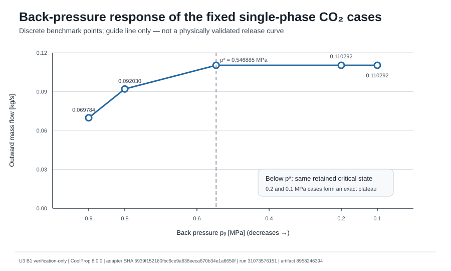
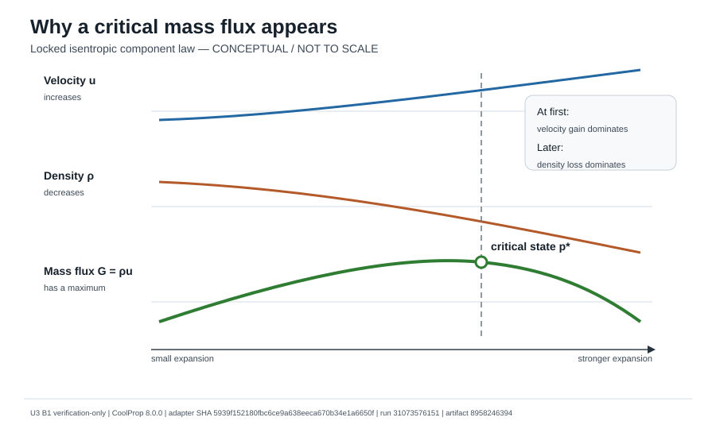
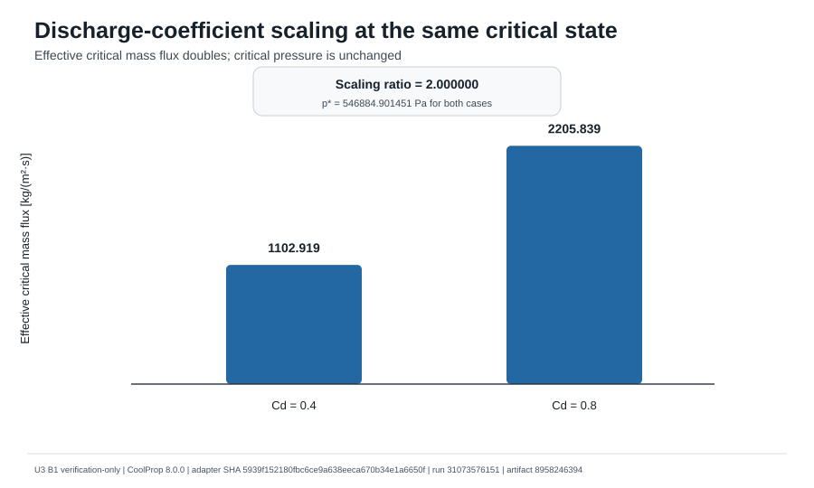
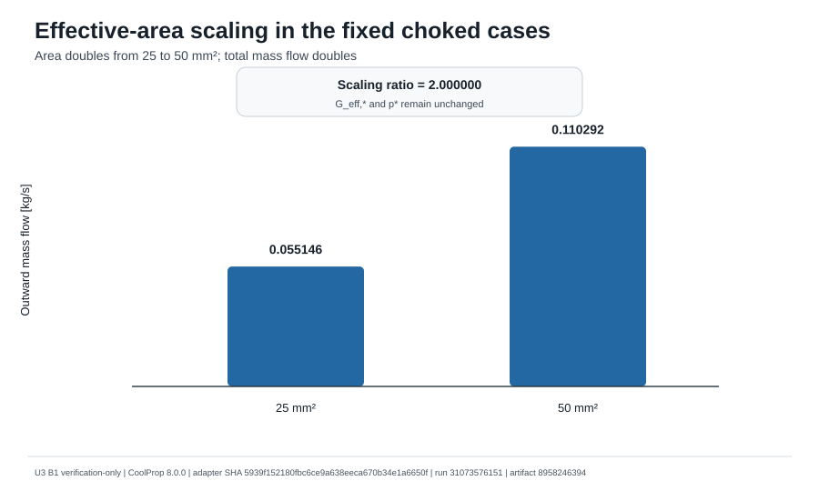
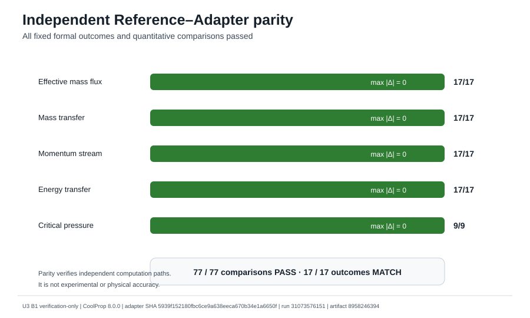
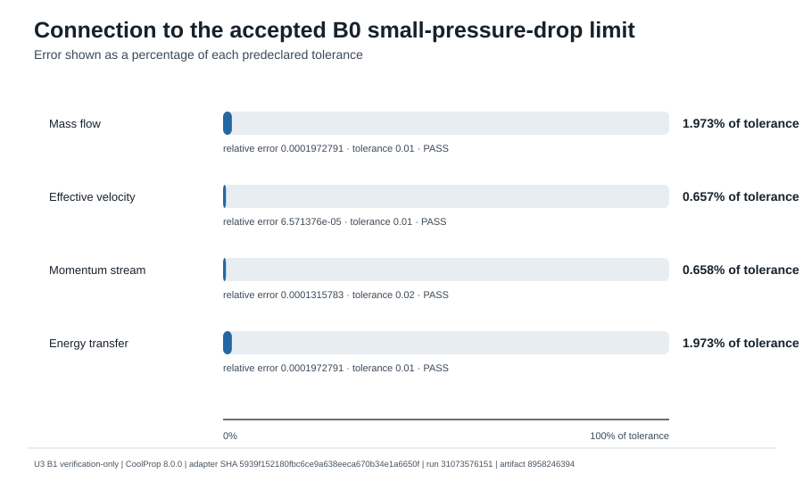
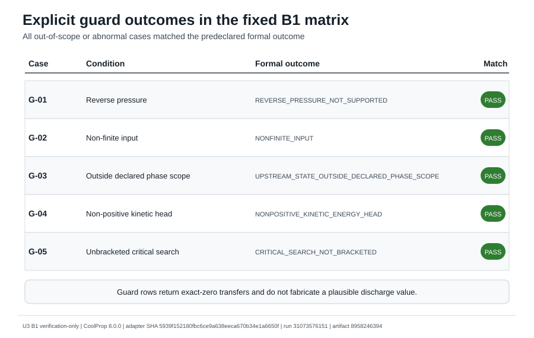

# 第12章　U3 B1 単相圧縮性流出および臨界状態ベンチマーク

## 12.1 本章の目的

本章の目的は、固定した上流状態からの**単相CO₂圧縮性流出component**について、次を独立ReferenceとAdapterでverificationすることである。

- 背圧に支配される非チョーク流れ。
- 臨界状態の探索。
- チョーク後の流量プラトー。
- 有効開口面積および流量係数 $C_d$ のスケーリング。
- 質量、運動量stream、エンタルピー移送量。
- 異常条件・適用外条件に対するGuard判定。

ここでいうverificationは、

> 固定contractの数式、探索手順、判定ロジックおよびtransfer構築が、独立経路で得た期待値と一致することを確認する作業

である。

したがって、本章は、実験値との一致、実破断口流量、二相チョーク、非平衡フラッシング、設計利用を直接保証しない。

## 12.2 評価対象と適用範囲

### 12.2.1 評価対象

| 項目 | 内容 |
|---|---|
| 上流状態 | 固定された上流停滞圧力・停滞温度 |
| 流出経路 | 等エントロピー単相候補経路 |
| 非チョーク | 背圧状態でtransferを評価 |
| チョーク | 臨界状態でtransferを固定 |
| 保存量stream | 質量、運動量stream、エンタルピー |
| パラメータ | 有効開口面積、$C_d$ |

### 12.2.2 対象外

```text
two-phase critical discharge
non-equilibrium flashing
real rupture / valve geometry
static pressure-force FVM mapping
finite-pipe FVM coupling
receiver dynamics
friction
gravity / elevation
wall heat transfer
solid CO2
physical validation
design sizing
production activation
```

## 12.3 Locked component law

### 12.3.1 上流停滞状態

上流状態を、

$$
p_0,\qquad T_0,\qquad h_0,\qquad s_0
$$

で定義する。単相ガス臨界流ケースでは、

$$
p_0=1.0\ \mathrm{MPa},
\qquad
T_0=320\ \mathrm{K}
$$

を固定した。

### 12.3.2 等エントロピー候補経路

候補圧力 $p$ に対して、

$$
s(p)=s_0
$$

を満たす状態を構築する。理想流速と理想質量流束は、

$$
u_{\mathrm{ideal}}(p)
=\sqrt{2\left[h_0-h(p,s_0)\right]}
$$

$$
G_{\mathrm{ideal}}(p)
=\rho(p,s_0)u_{\mathrm{ideal}}(p)
$$

である。

### 12.3.3 流量係数と有効開口面積

$$
u_{\mathrm{eff}}=C_d u_{\mathrm{ideal}}
$$

$$
G_{\mathrm{eff}}=C_d G_{\mathrm{ideal}}
$$

$$
\dot m=A_{\mathrm{eff}}G_{\mathrm{eff}}
$$

したがって、contract上、$C_d$ は有効流速と有効質量流束を比例的に変え、$A_{\mathrm{eff}}$ は総流量を比例的に変える。臨界圧力は理想質量流束の最大位置で決まり、$C_d$ に依存しない。

### 12.3.4 Stream transferと符号

正符号はmodeled domainから外向きである。

$$
\dot M_{\mathrm{stream}}=\dot m\,u_{\mathrm{eff}}
$$

$$
\dot E_{\mathrm{enthalpy}}=\dot m\,h_0
$$

static pressure forceはB1に含めず、後続のFVM-face mapping contractへ明示的に延期した。

## 12.4 臨界状態探索とchoking rule

### 12.4.1 臨界状態

$$
p_*=\underset{p}{\operatorname{arg\,max}}\;G_{\mathrm{ideal}}(p)
$$

探索は、

1. pressure ratioの4097-node粗探索。
2. 内点最大のbracketing。
3. deterministic golden-section refinement。
4. retained endpointsを含む最終最大選択。

の順で行う。

### 12.4.2 非チョーク／チョーク判定

背圧を $p_b$ とすると、

$$
p_b>p_*+\varepsilon_p
$$

では非チョークとして背圧状態を評価する。

$$
p_b\le p_*+\varepsilon_p
$$

ではチョークとして臨界状態を採用する。

このルールにより、背圧が臨界圧力より高い範囲では背圧低下に伴って流量が増加し、臨界圧力以下ではtransferがプラトーとなる。

## 12.5 ReferenceとAdapterの独立性

| 経路 | 役割 |
|---|---|
| Reference | pinned source SHAから期待値を独立再構築 |
| Adapter | low-level CoolProp pathと独立探索を実装 |
| Comparison | formal outcome、flux、transfer、critical pressureを照合 |

共有しないもの：

```text
property-path helper
critical-search helper
refinement helper
transfer helper
Reference module import
```

Referenceのhistorical Artifactはauthority証跡として保持するが、Adapter workflowはpinned Reference source SHAからReferenceを再構築するため、Artifact retentionへ実行依存しない。

## 12.6 Fixed matrixとauthoritative execution

### 12.6.1 Fixed matrix

```text
physical cases:                  12
guard cases:                      5
total cases:                     17
flux / transfer comparisons:     68
critical-pressure comparisons:    9
total comparisons:               77
```

### 12.6.2 Reference authority

```text
PR / source / merge:             #131 / c7c25efae0e53a8b5f5ed164f9135238c6e005e0 / fa6c0ba14eb15dae482ee7766d03f7e1fca3574f
run / artifact:                  31051697864 / 8951665941
ZIP SHA256:                      b3ba4ed848c9d01a9c1232efa8fa97b46e80bf61185c151f2f6acde6440a4f94
fixed outcomes:                  17 / 17 MATCH
tests:                           11 / 27 / 930 passed
```

### 12.6.3 Adapter authority

```text
PR / source / merge:             #133 / 5939f152180fbc6ce9a638eeca670b34e1a6650f / e97be21de9b6cc62f527548e1047bc9d4ad759c1
run / job / artifact:            31073576151 / 92526482937 / 8958246394
ZIP SHA256:                      b2b5b0ba68f58f72538c98a4570756360c5e8e3be87d3afdd797064464cf6aa2
internal manifest:               12 / 12 verified
comparison passes:               77 / 77
final-head workflows:            16 / 16 SUCCESS
tests:                           11 / 38 / 941 passed
skips / failures / errors:       0 / 0 / 0
```

`pytest deselected 2`は、別workflow向け試験が選択対象外であったことを示し、skip、failure、errorではない。

## 12.7 計算結果

### 12.7.1 背圧低下に対する応答



高背圧側の固定ケースでは、背圧を0.9 MPaから0.8 MPaへ下げると質量流量が増加した。臨界圧力以下の0.2 MPaと0.1 MPaでは同じ臨界状態が採用され、流量は一致した。

```text
critical pressure ratio:  0.5468849014513074
critical pressure:        546884.9014513075 Pa
```

図の線は固定ケース点を読みやすく結んだguideであり、物理Validation済みrelease curveではない。

### 12.7.2 臨界質量流束が現れる仕組み



質量流束は、

$$
G=\rho u
$$

である。等エントロピー膨張に伴い、流速は増加し、密度は低下する。初期には流速増加が支配的で $G$ は増加するが、さらに膨張すると密度低下が強くなり、最大点が現れる。

この図はlocked lawを説明する概念図であり、解析結果曲線ではない。

### 12.7.3 Critical-state values

```text
critical temperature:              278.641212617351 K
critical density:                  10.763564829778 kg/m^3
ideal critical mass flux:          2757.298423561355 kg/(m^2 s)
final bracket width:               0.890336811077 Pa
peak prominence relative:          2.262737064344181e-08
```

### 12.7.4 $C_d$ scaling



```text
Cd = 0.4:  G_eff,* = 1102.919369424542 kg/(m^2 s)
Cd = 0.8:  G_eff,* = 2205.838738849084 kg/(m^2 s)
ratio:                 2.0
critical-pressure relative difference: 0.0
```

$C_d$を2倍にすると有効質量流束は2倍となった。一方、臨界圧力は一致した。

### 12.7.5 Area scaling



有効開口面積を $2.5\times10^{-5}$ から $5.0\times10^{-5}\ \mathrm{m^2}$へ2倍にすると、固定choked caseの総質量流量は2倍となった。有効質量流束と臨界圧力は変化しない。

### 12.7.6 Reference–Adapter parity



77比較はすべてpredeclared tolerance内でPASSした。formal outcomeも17ケースすべて一致した。

これは**計算経路のparity**を示す。実験値または実配管流量との一致を示すものではない。

## 12.8 B0 limiting behaviorとGuard

### 12.8.1 B0 small-pressure-drop limit



| Measure | Relative error | Tolerance | Result |
|---|---:|---:|---|
| mass flow | `0.0001972791257517814` | `0.01` | PASS |
| effective velocity | `6.571376381353641e-05` | `0.01` | PASS |
| momentum stream | `0.0001315783258920566` | `0.02` | PASS |
| energy transfer | `0.000197279125751925` | `0.01` | PASS |

B1は固定小圧力差液体caseにおいて、accepted B0 lawへcontract tolerance内で接続した。

### 12.8.2 Guard matrix



```text
G-01 reverse pressure
G-02 non-finite input
G-03 upstream state outside declared single-phase scope
G-04 non-positive kinetic-energy head
G-05 critical search not bracketed
```

全Guard caseは想定formal outcomeへ分類された。これは、適用外条件で物理的にもっともらしい数値を無条件に返さないためのsoftware-verification evidenceである。

## 12.9 Supported claimとapproval boundary

### 12.9.1 Supported

- locked single-phase compressible lawの独立再現。
- deterministic critical-state search。
- fixed unchoked orderingとbelow-critical plateau。
- area / $C_d$ scaling。
- exact-zero identities。
- B0 limit connection。
- explicit guard classification。

### 12.9.2 Remain false

```text
physical_discharge_boundary_approved = false
two_phase_critical_discharge_accuracy_approved = false
integrated_blowdown_model_approved = false
physical_validation = false
design_use_acceptance = false
production_hem_activation_approved = false
```

## 12.10 次のcontrolled work

```text
B1 single-phase critical component
    ↓
static-pressure-force contract
    ↓
FVM boundary-face mapping
    ↓
finite-pipe dynamic coupling
    ↓
pipe inventory / cumulative discharge closure
    ↓
reflected pressure-wave verification
    ↓
single-phase stability / guard matrix
    ↓
only then: two-phase critical-discharge contract
```

実装前に、mass / momentum / energy signs、boundary-cell update、choking-state adoption、tolerances、Reference / Adapter independenceを固定する。

## 12.11 結論

U3 B1では、固定単相CO₂条件に対して、非チョーク流れ、臨界状態探索、チョーク後のプラトー、面積比例、$C_d$比例、B0 limit、Guard分類を確認した。

独立ReferenceとAdapterは17ケース・77比較で一致し、authoritative Adapter workflow、Artifact manifest、専用・関連・全体回帰試験はcleanであった。

したがって、

> 固定contract下の単相圧縮性流出componentについて、計算ロジックのverification-only benchmarkは成立した

と判断する。

ただし、物理流出境界、有限配管coupling、二相臨界流、物理Validation、設計利用、production適用は未承認である。

## 付記　Figure provenance

F20–F26は次から再生成した。

```text
Adapter source SHA:   5939f152180fbc6ce9a638eeca670b34e1a6650f
workflow run:         31073576151
artifact ID:          8958246394
Artifact ZIP SHA256:  b2b5b0ba68f58f72538c98a4570756360c5e8e3be87d3afdd797064464cf6aa2
property backend:     CoolProp 8.0.0
source files:         adapter_cases.csv
                      reference_adapter_comparison.csv
                      guard_outcomes.csv
                      critical_state_summary.json
                      summary.json
                      benchmark_contract.json
```
