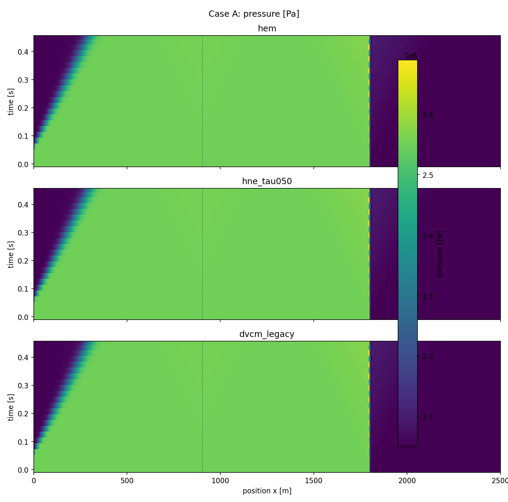
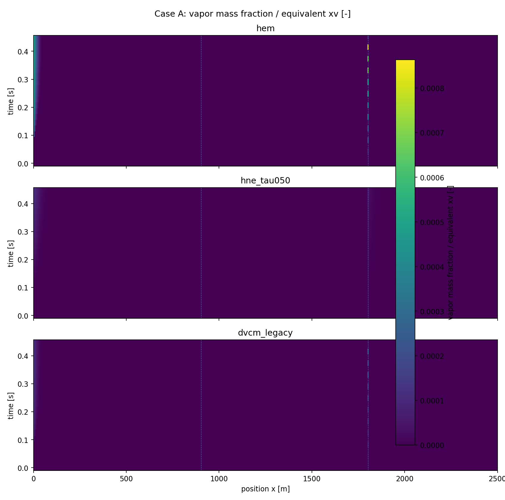
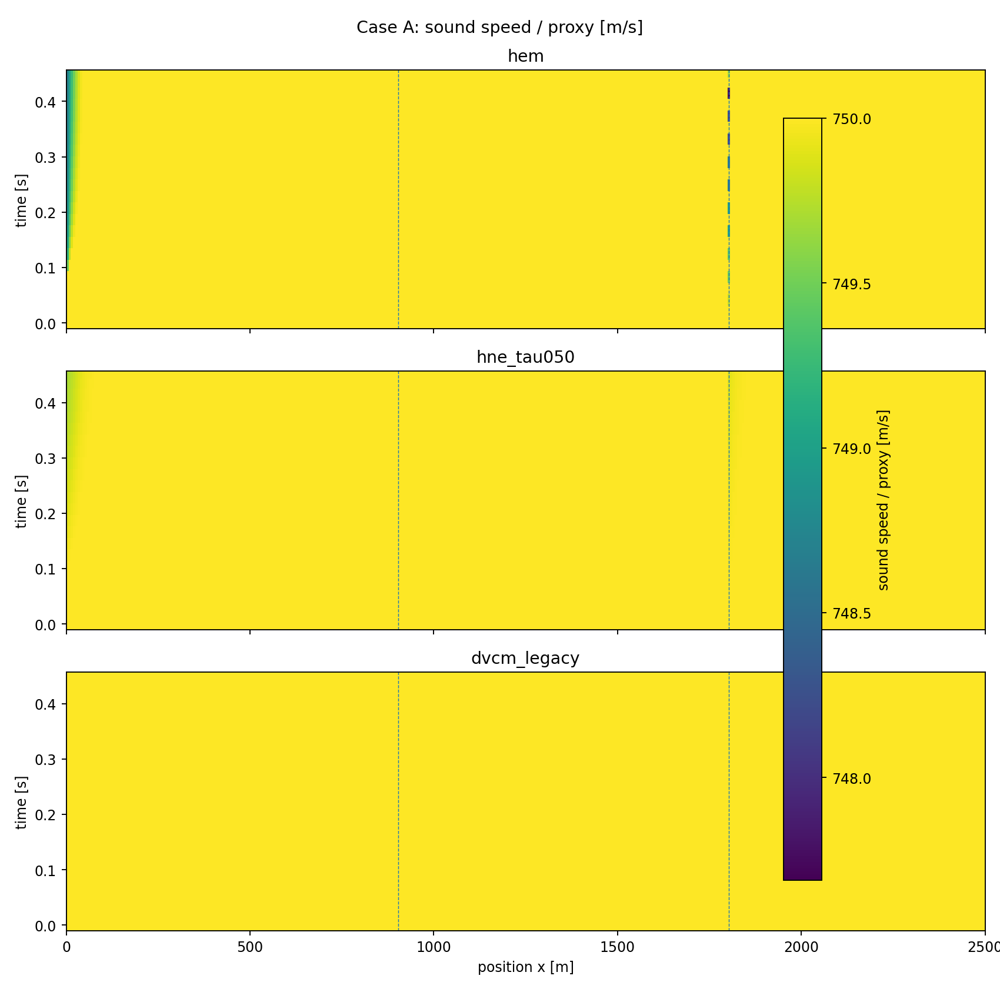
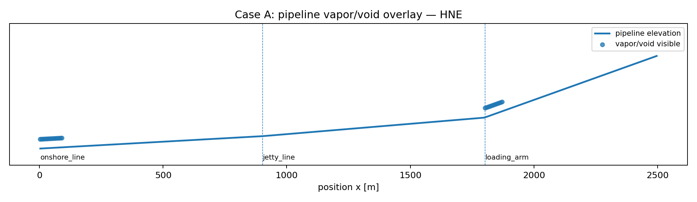
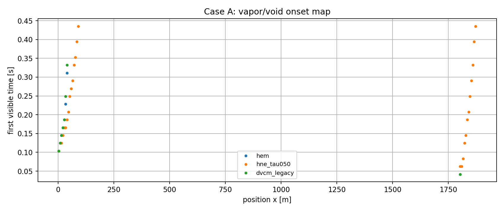

# Case A 担当者用レポート — Ver.0.7.0

## 1. 目的

ポンプ揚程急減に伴う減圧応答で、相変化遅れの影響を確認するケース。

## 2. シナリオ設定

ESD弁は開いたまま、ポンプ揚程を短時間で低下させる。現モデルでは準定常ポンプ境界であり、動的ポンプ特性は未導入。

| Parameter | Value |
|---|---:|
| t_end | 0.450 s |
| upstream pressure | 1.950e+06 Pa |
| downstream pressure | 2.050e+06 Pa |
| pump nominal Δp | 6.000e+05 Pa |
| pump trip start | 0.05 |
| ESD close start | 10.000 s |
| ESD close time | 1.000 s |
| p_sat surrogate | 2.050e+06 Pa |
| HNE τ | 0.500 s |

## 3. 比較結果

| Model | max alpha/cavity | max xv/equiv | min c/proxy [m/s] | max inventory | unit | max visible length [m] |
|---|---|---|---|---|---|---|
| hem | 0.001146 | 8.632e-04 | 747.7 | 0.9545 | kg vapor | 50 |
| hne_tau050 | 1.491e-04 | 1.122e-04 | 749.7 | 0.3016 | kg vapor | 168.8 |
| dvcm_legacy | 2.835e-04 | 2.134e-04 | 750 | 3.374e-04 | m3 cavity proxy | 50 |

## 4. 解釈

ポンプ急停止では二相化量はD/Eより小さいが、HEMが最も強く、HNEが抑制される傾向は明確。専用ポンプ動特性導入前の識別評価。

DVCMは空洞体積 proxy であり、HEM/HNEの蒸気質量・ボイド率と同一物理量ではありません。比較図では、**どこで現象が現れるか**、**手法により強さ・広がりがどう変わるか**を見る目的で同じ枠に載せています。

## 5. 図

## 6. データ

- Summary CSV: `case_a_summary_v0_7_0.csv`
- Field CSV: `case_a_fields_v0_7_0.csv`

## 7. 制約

このケースは手法識別用の surrogate 条件です。設計評価に使うには、accepted LCO₂ property backend / project-approved reference table に置換し、Caseごとの再評価が必要です。
