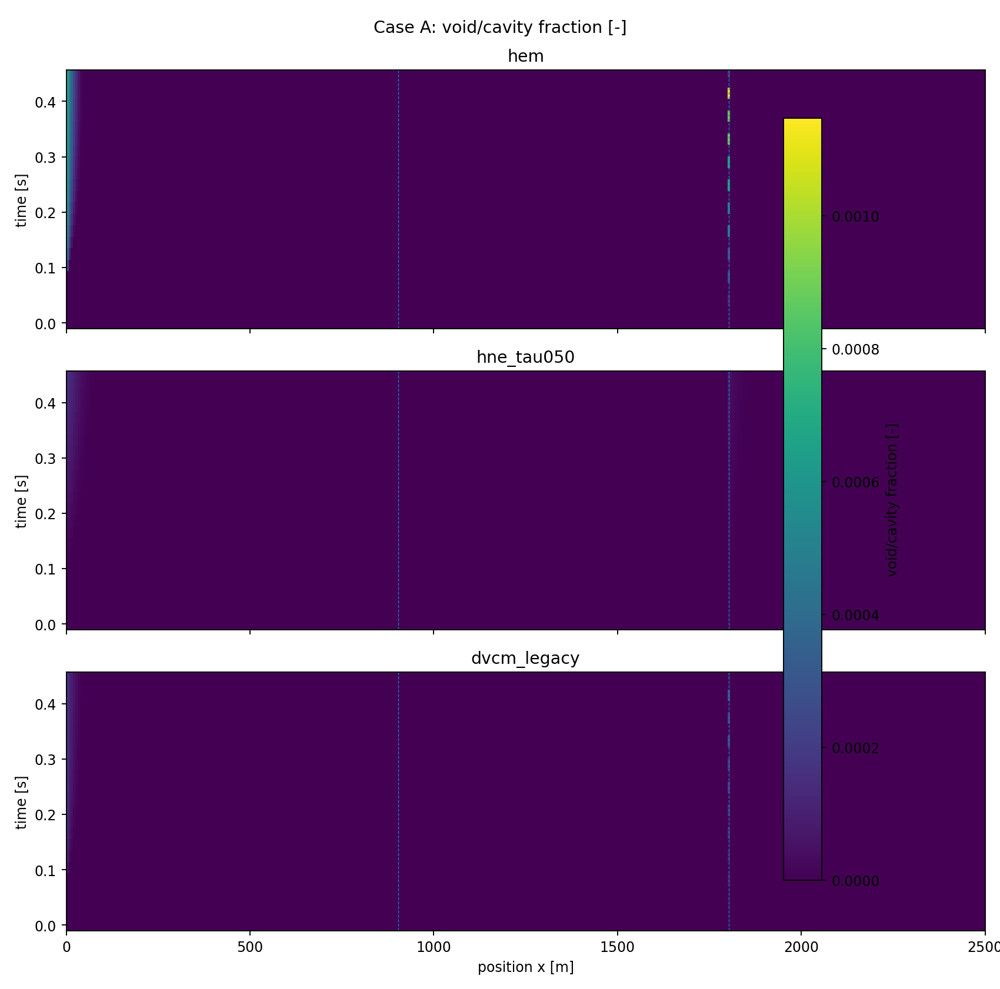

# Case A レビュアー用1枚サマリ — Ver.0.7.0

## 1. 何を見るケースか

**ポンプ急停止識別ケース**  
ポンプ揚程急減に伴う減圧応答で、相変化遅れの影響を確認するケース。

## 2. 結論

ポンプ急停止では二相化量はD/Eより小さいが、HEMが最も強く、HNEが抑制される傾向は明確。専用ポンプ動特性導入前の識別評価。

このケースは **手法差を見せる識別ケース**であり、設計採用値ではありません。基準物性は surrogate / amplified discrimination setting です。

## 3. 主要結果

| Model | max alpha/cavity | max xv/equiv | min c/proxy [m/s] | max inventory | unit | max visible length [m] |
|---|---|---|---|---|---|---|
| hem | 0.001146 | 8.632e-04 | 747.7 | 0.9545 | kg vapor | 50 |
| hne_tau050 | 1.491e-04 | 1.122e-04 | 749.7 | 0.3016 | kg vapor | 168.8 |
| dvcm_legacy | 2.835e-04 | 2.134e-04 | 750 | 3.374e-04 | m3 cavity proxy | 50 |

## 4. 一目で見る図

## 5. 読み方

- **HEM**: 即時平衡。二相化を強め・早めに出す上限側比較。
- **HNE**: 相変化遅れあり。主評価候補。
- **DVCM**: 従来モデルの空洞 proxy。位置比較には有用だが、連続二相音速低下は表さない。

詳細は担当者用レポートを参照してください。
