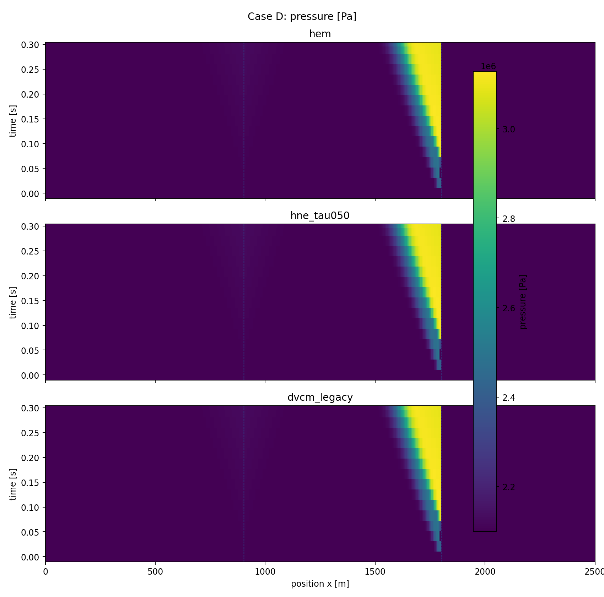
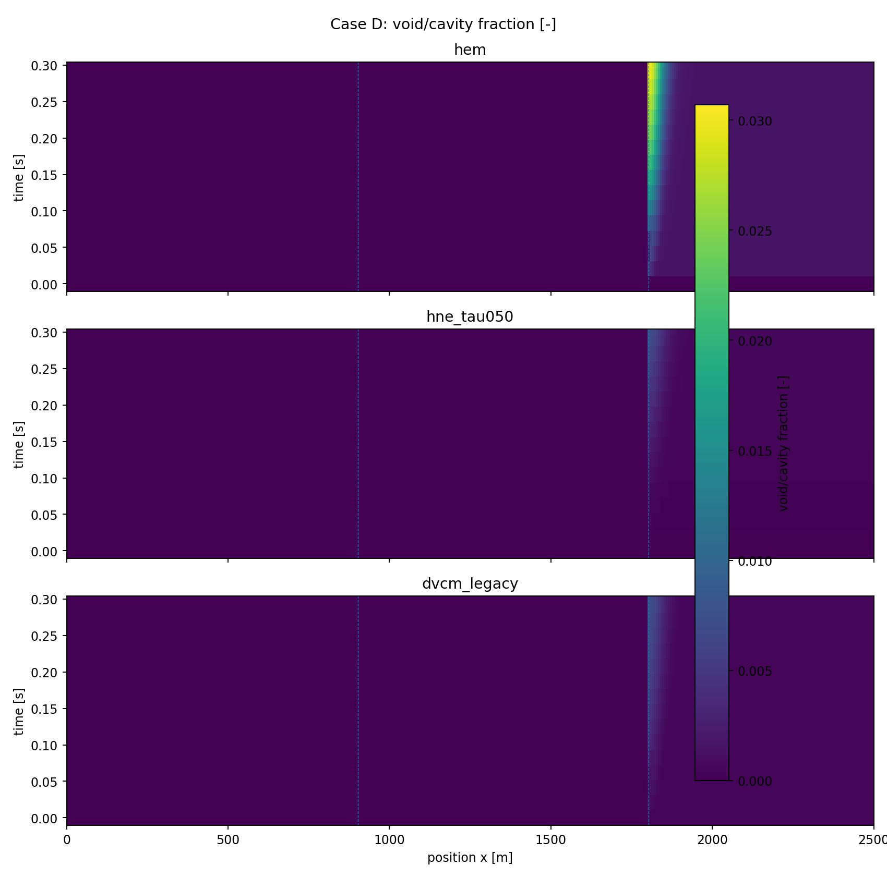
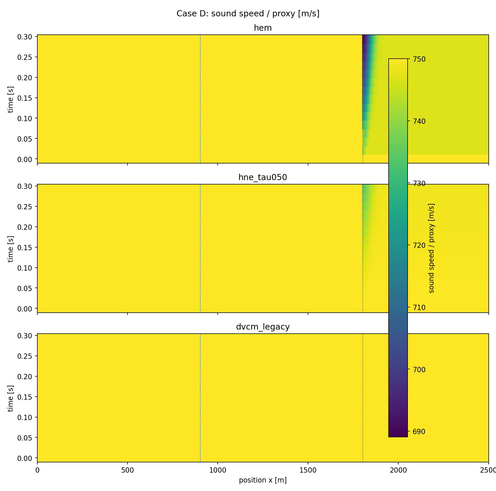
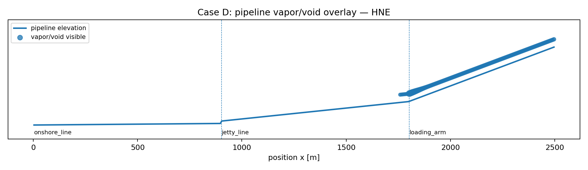
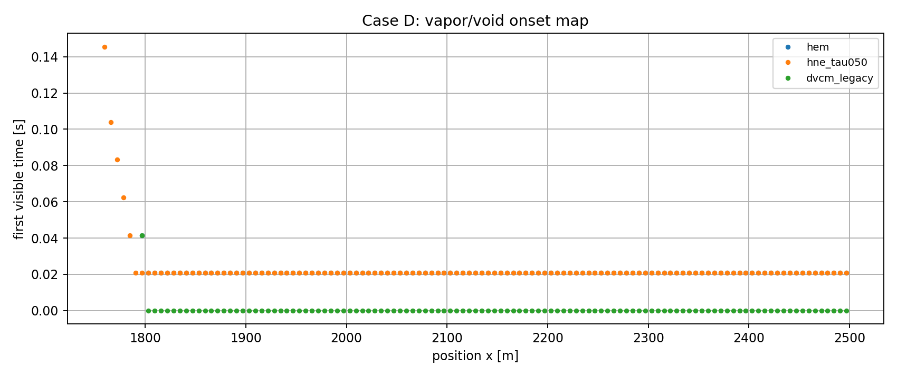

# Case D 担当者用レポート — Ver.0.7.0

## 1. 目的

高所部・下流側で二相化が見えるようにした、手法差確認用ケース。

## 2. シナリオ設定

高所部の静圧余裕が小さい状態で、loading arm 側に蒸気/ボイドが発生する想定。

| Parameter | Value |
|---|---:|
| t_end | 0.300 s |
| upstream pressure | 2.000e+06 Pa |
| downstream pressure | 1.900e+06 Pa |
| pump nominal Δp | 1.000e+05 Pa |
| pump trip start | none |
| ESD close start | 0.050 s |
| ESD close time | 0.020 s |
| p_sat surrogate | 2.100e+06 Pa |
| HNE τ | 0.500 s |

## 3. 比較結果

| Model | max alpha/cavity | max xv/equiv | min c/proxy [m/s] | max inventory | unit | max visible length [m] |
|---|---|---|---|---|---|---|
| hem | 0.03069 | 0.02328 | 689.1 | 121.9 | kg vapor | 706.2 |
| hne_tau050 | 0.007449 | 0.005617 | 735 | 39.98 | kg vapor | 743.8 |
| dvcm_legacy | 0.007447 | 0.005616 | 750 | 0.04308 | m3 cavity proxy | 706.2 |

## 4. 解釈

HEMは即時平衡のため広く強く二相化し、HNEは遅れにより弱く出る。DVCMは空洞proxyとして出るが、連続二相音速低下は表さない。

DVCMは空洞体積 proxy であり、HEM/HNEの蒸気質量・ボイド率と同一物理量ではありません。比較図では、**どこで現象が現れるか**、**手法により強さ・広がりがどう変わるか**を見る目的で同じ枠に載せています。

## 5. 図

## 6. データ

- Summary CSV: `case_d_summary_v0_7_0.csv`
- Field CSV: `case_d_fields_v0_7_0.csv`

## 7. 制約

このケースは手法識別用の surrogate 条件です。設計評価に使うには、accepted LCO₂ property backend / project-approved reference table に置換し、Caseごとの再評価が必要です。
