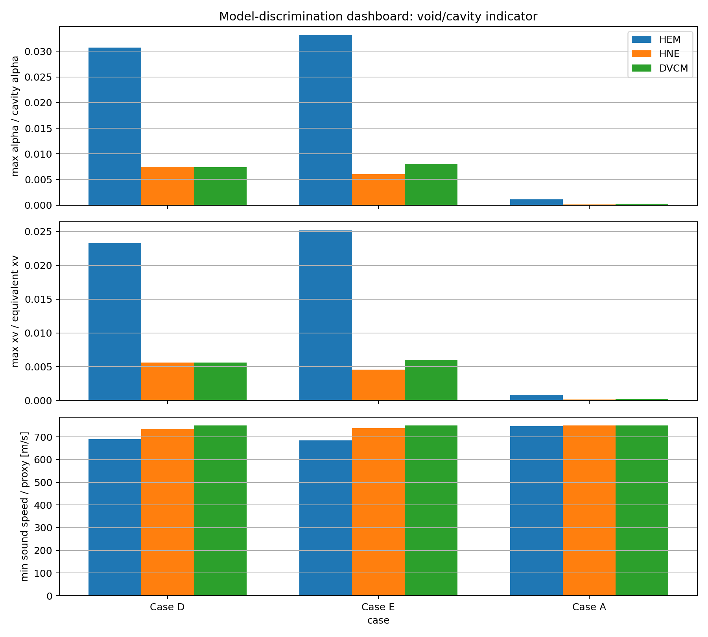

# Case D/E/A 識別ケース 統合レビュアーサマリ — Ver.0.7.0

## 1. 目的

Case C では HEM/HNE/DVCM の差が小さかったため、**手法差が見える条件**として Case D/E/A を作成しました。  
本パッケージは、レビュアーがまず概要を読み、必要に応じて担当者レポート・詳細図へ進める三層形式です。

## 2. 読む順序

1. この統合サマリ
2. 各 Case の `*_reviewer_one_page_v0_7_0.md`
3. 必要に応じて `*_engineer_report_v0_7_0.md`
4. CSV/field data は技術確認用

## 3. 統合ダッシュボード

## 4. 全体比較表

| Case | Model | max alpha/cavity | max xv/equiv | min c/proxy [m/s] | max inventory | unit |
|---|---|---|---|---|---|---|
| Case D | hem | 0.03069 | 0.02328 | 689.1 | 121.9 | kg vapor |
| Case D | hne_tau050 | 0.007449 | 0.005617 | 735 | 39.98 | kg vapor |
| Case D | dvcm_legacy | 0.007447 | 0.005616 | 750 | 0.04308 | m3 cavity proxy |
| Case E | hem | 0.03319 | 0.02519 | 684.2 | 97.64 | kg vapor |
| Case E | hne_tau050 | 0.006049 | 0.00456 | 737.8 | 26.03 | kg vapor |
| Case E | dvcm_legacy | 0.00801 | 0.006041 | 750 | 0.0345 | m3 cavity proxy |
| Case A | hem | 0.001146 | 8.632e-04 | 747.7 | 0.9545 | kg vapor |
| Case A | hne_tau050 | 1.491e-04 | 1.122e-04 | 749.7 | 0.3016 | kg vapor |
| Case A | dvcm_legacy | 2.835e-04 | 2.134e-04 | 750 | 3.374e-04 | m3 cavity proxy |

## 5. 一言結論

- **Case D 高所部フラッシング**: HEM/HNE/DVCMの差が最も見やすい。高所・下流側の二相化位置確認に有効。
- **Case E 飽和近傍ESD急閉**: HEMが明確に大きく、HNE遅れが見える。ESD時のモデル差説明に有効。
- **Case A ポンプ急停止**: 二相化量はD/Eより小さいが、HEM/HNE差は確認できる。今後の動的ポンプモデル導入対象。

## 6. 注意

これらは **識別ケース**です。実設計評価ではありません。  
目的は「モデル差を理解すること」であり、「この圧力・ボイド率を設計値として採用すること」ではありません。
