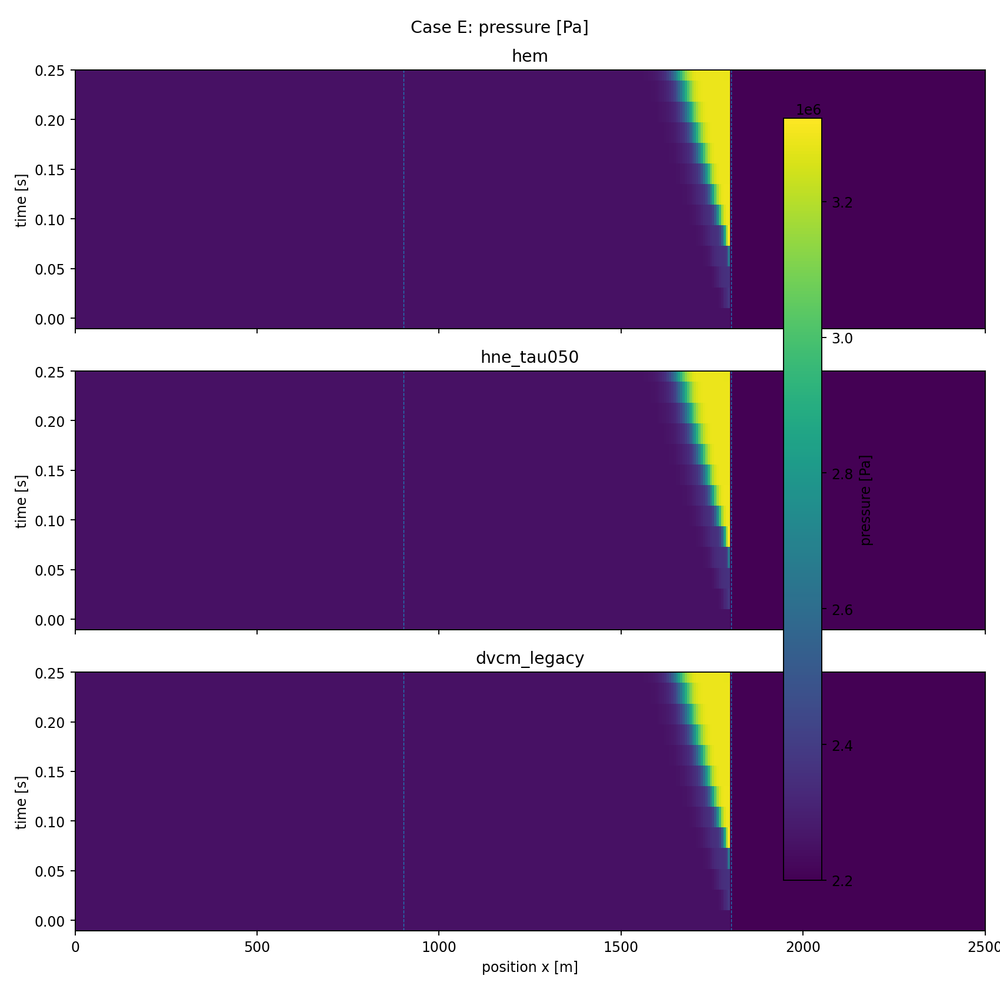
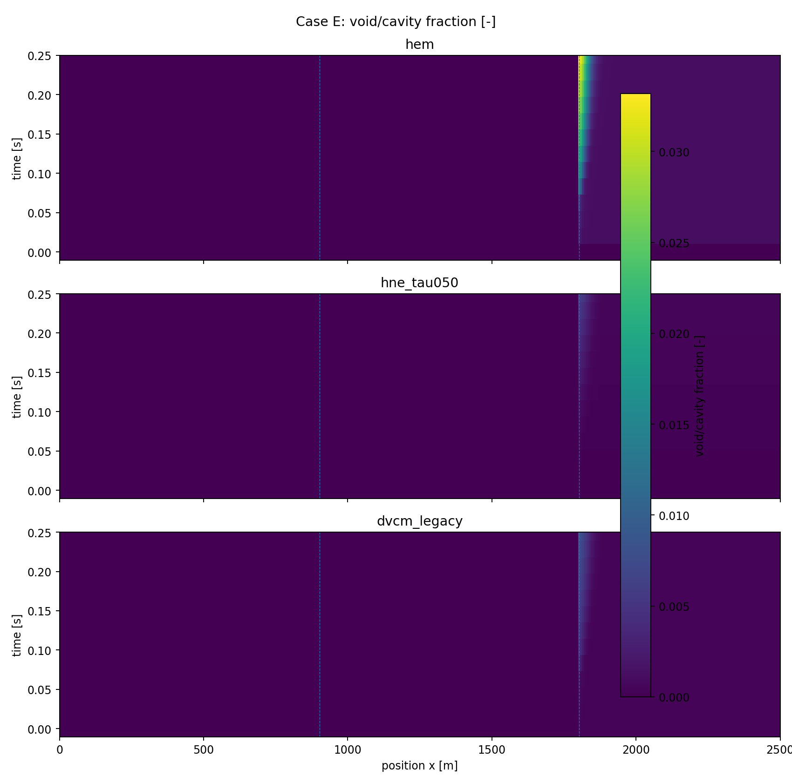
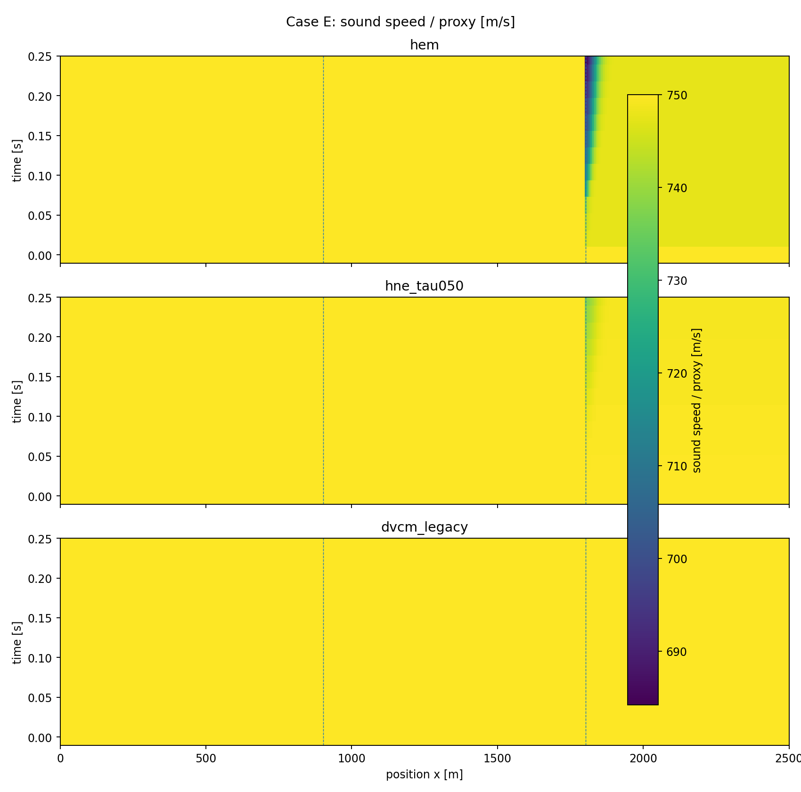
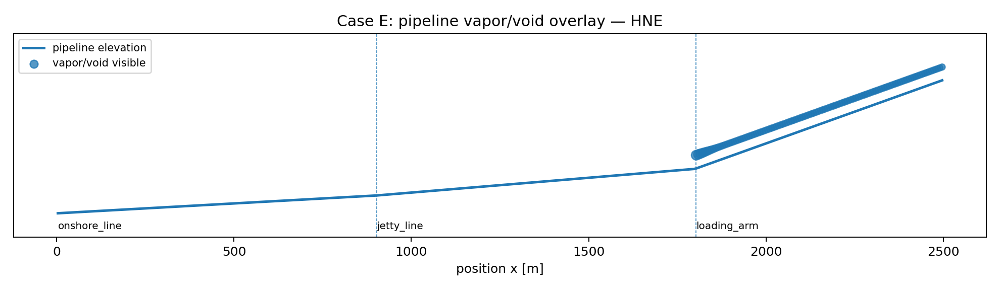
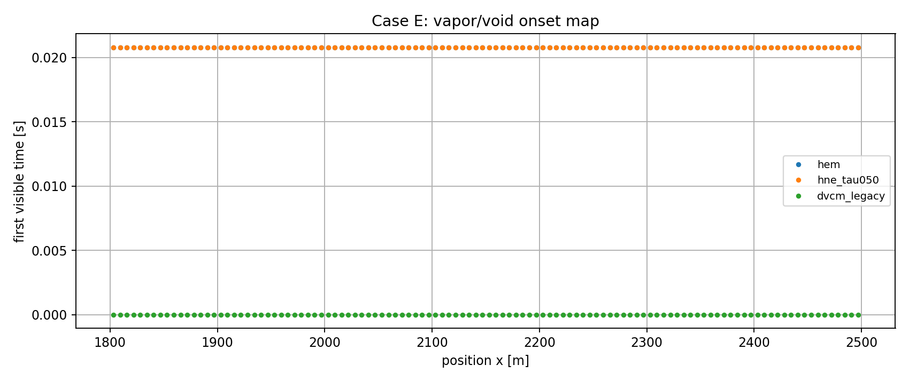

# Case E 担当者用レポート — Ver.0.7.0

## 1. 目的

飽和近傍でESD急閉した場合の、HEM即時平衡とHNE遅れの差を見せるケース。

## 2. シナリオ設定

全体系を飽和近傍に寄せ、ESD閉止で下流側の二相化が明瞭になるようにした。

| Parameter | Value |
|---|---:|
| t_end | 0.250 s |
| upstream pressure | 2.100e+06 Pa |
| downstream pressure | 2.050e+06 Pa |
| pump nominal Δp | 1.500e+05 Pa |
| pump trip start | none |
| ESD close start | 0.050 s |
| ESD close time | 0.015 s |
| p_sat surrogate | 2.200e+06 Pa |
| HNE τ | 0.500 s |

## 3. 比較結果

| Model | max alpha/cavity | max xv/equiv | min c/proxy [m/s] | max inventory | unit | max visible length [m] |
|---|---|---|---|---|---|---|
| hem | 0.03319 | 0.02519 | 684.2 | 97.64 | kg vapor | 700 |
| hne_tau050 | 0.006049 | 0.00456 | 737.8 | 26.03 | kg vapor | 700 |
| dvcm_legacy | 0.00801 | 0.006041 | 750 | 0.0345 | m3 cavity proxy | 700 |

## 4. 解釈

Case Cよりも二相化指標が大きく、HEMとHNEの差が一読で見える。DVCMは空洞発生位置の参考比較として有用。

DVCMは空洞体積 proxy であり、HEM/HNEの蒸気質量・ボイド率と同一物理量ではありません。比較図では、**どこで現象が現れるか**、**手法により強さ・広がりがどう変わるか**を見る目的で同じ枠に載せています。

## 5. 図

## 6. データ

- Summary CSV: `case_e_summary_v0_7_0.csv`
- Field CSV: `case_e_fields_v0_7_0.csv`

## 7. 制約

このケースは手法識別用の surrogate 条件です。設計評価に使うには、accepted LCO₂ property backend / project-approved reference table に置換し、Caseごとの再評価が必要です。
